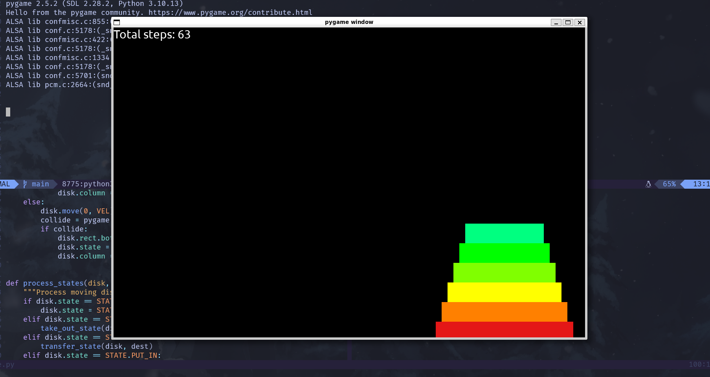

---

# ⇁ Hanoi Tower Game
The Tower of Hanoi is a mathematical game or puzzle consisting of three rods and a number of disks of various diameters, which can slide onto any rod. This repository will help you virtualize the best way to solve the problem.

---

# ⇁ Warning
This is only a small project made in 3 days, so there will be some bugs that i don't know :cry:

---

# ⇁ Setup 
`pygame` required for this project to work. Run this command to install all dependencies needed:
```bash
pip install -r requirements.txt
```
---

# ⇁ How to use
You need to execute `game.py` file
```python
python3 game.py
```
When the app is running, you can press `space` or `enter` and the app will start solving, and you can press `esc` or click on the `x` button on the top right of the app screen to exit and turn off the app.

# ⇁ Configuration
You can change any configs in `config.py` to your liking, like `NUMBER_OF_DISKS` to 6 if you want to solve 6 disks.\
Full configuration options will be in the list below:
| Option | Description |
| ------ | ----------- |
| WIDTH   | width of the window screen. |
| HEIGHT | height of the window screen. |
| FPS    | frames per seconds. Determine maximum how many frames can be updated per second. This also depends on your machine. |
| NUMBER_OF_DISKS | number of disks to solve. |
| SRC_COLUMN | this is the column that will contain disks from the beginning, can be only 1, 2 or 3. |
| TARGET_COLUMN | this is the column that will contain result disks, can be only 1, 2 or 3. |
| HELPER_COLUMN | this is the remaining column, can be only 1, 2 or 3. |
| MAX_DISK_WIDTH | determine the width of the bottom disk. |
| DISK_SIZE_DECREASE | determine the difference in size between 2 adjacent disks. |
| DEFAULT_DISK_HEIGHT | the height of the disk. |
| FONT | for now, it only supports system font i think. |
| FONT_SIZE | set font size for the font. |
| DISK_COLORS | list of colors for the list, you can add more or change colors. |

---

# ⇁ File structure
```
hanoi-tower-game
|__ config.py
|__ game.py
|__ hanoi_tower.py
|__ requirements.py
```
---


